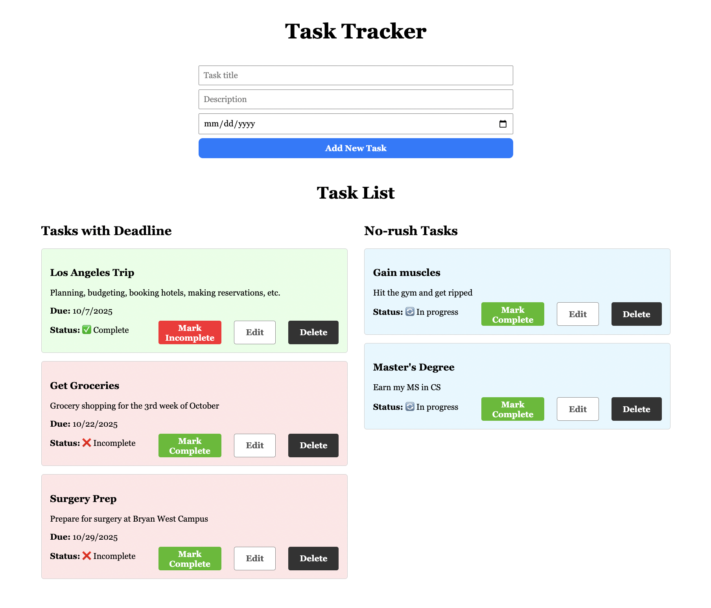

# Task Tracker

A full-stack task management application built with React for the front end and ASP.NET Core Web API for the back end. This project demonstrates CRUD operations, real-time UI updates, CORS setup, HTTPS configuration, and deployment to Azure.

---

## Website

Check out the **Task Tracker** web UI (React front end) hosted at:  
[https://white-pond-0be28ef1e.1.azurestaticapps.net](https://white-pond-0be28ef1e.1.azurestaticapps.net)  

You can use the web app to:  
- View existing tasks  
- Add new tasks  
- Update or mark tasks as complete  

  

The back-end **API** is hosted at:  
[https://tasktracker-api-dccucqetcdbpfmam.canadacentral-01.azurewebsites.net](https://tasktracker-api-dccucqetcdbpfmam.canadacentral-01.azurewebsites.net)  

It supports standard REST operations on the `/api/Tasks/` endpoint:  
- `GET` – retrieve tasks  
- `POST` – create a new task  
- `PUT` / `PATCH` – update existing tasks  
- `DELETE` – remove tasks

---

## Features

- Create, read, update, and delete tasks
- Tasks can have optional due dates
- Tasks are displayed in two columns: tasks with deadlines and no-rush tasks
- Tasks are color-coded based on completion and urgency status
- Responsive design with clean UI
- Confirmation dialogs for updates and deletions using SweetAlert2
- Back-end API secured with CORS to allow frontend access
- HTTPS enabled for secure communication
- Deployment-ready with environment variable support for API URLs

---

## Tech Stack

- Front end: React, JavaScript, CSS
- Back end: ASP.NET Core Web API (C#)
- Database: SQL Server
- Deployment: Azure App Service (Backend), Azure Static Web Apps (Frontend)

---

## Getting Started

### Prerequisites

- Node.js (v16+ recommended)
- .NET 7 SDK or later
- Git

### Running Locally

1. Clone the repo:

```bash
git clone https://github.com/ajcalvet/task-tracker.git
cd task-tracker
```

2. Set up back end:

```
cd TaskTrackerAPI
dotnet restore
dotnet run
```

3. Setup front end:

Open a new terminal window/tab:

```
cd task-tracker-frontend
npm install
npm start
```

4. Open your browser at http://localhost:3000 to use the app.

### Deployment

The app is configured to be deployed on Azure:

Back-end API deployed via Azure App Service

Front-end React app deployed via Azure Static Web Apps

Update environment variables accordingly to point the front end to the live back-end URL.

### Database Setup

This app uses SQL Server as the back-end database.

#### Local Development:

We use Azure SQL Edge via Docker.

To run it locally:

```
docker run -e "ACCEPT_EULA=Y" -e "SA_PASSWORD=password" -p 1433:1433 --name sql1 -d mcr.microsoft.com/azure-sql-edge
```

Then your connection string in appsettings.Development.json should look like:

```
"ConnectionStrings": {
  "DefaultConnection": "Server=localhost,1433;Database=TaskTrackerDb;User Id=sa;Password=password;TrustServerCertificate=true;"
}
```

#### Production:

You'll need to configure a cloud SQL database (e.g., Azure SQL Database) and supply its connection string via environment variables in the App Service settings.

---

## Folder Structure

```
/TaskTrackerProject
  /TaskTrackerAPI          # .NET back end source code
  /tasktracker-frontend    # React front end source code
  README.md
```

---

## Author

Abel J. Calvet
